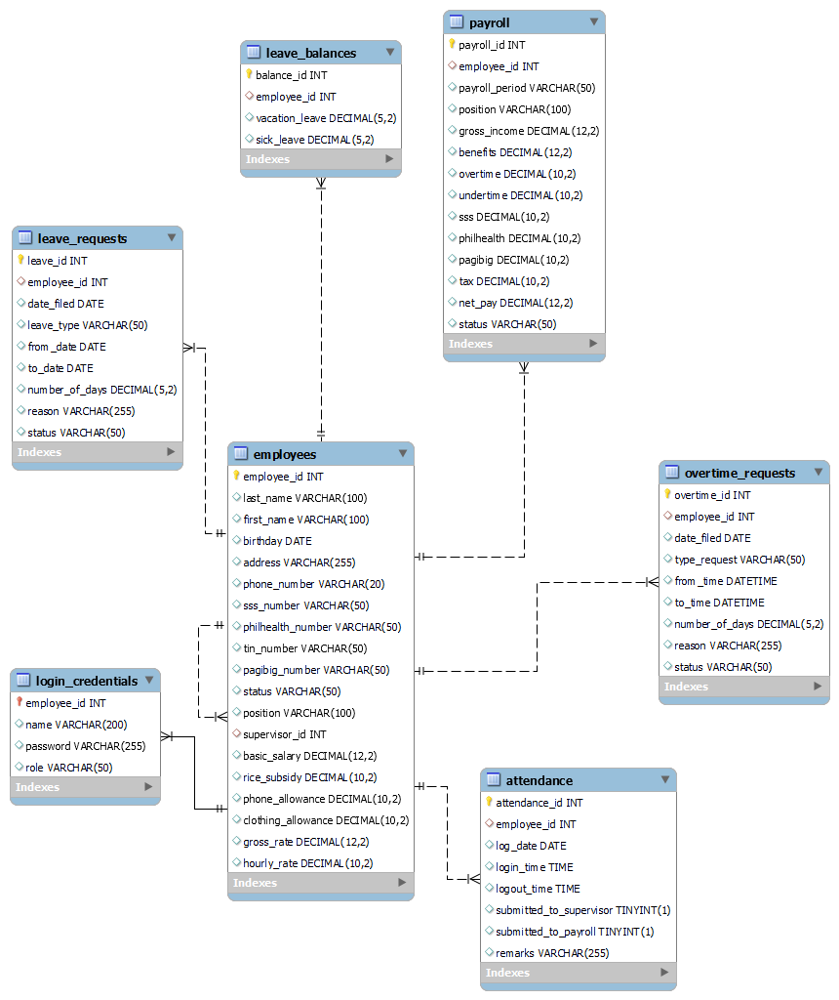

# 📁 Database Module – AOOP Payroll System

This folder contains the MySQL database dump, schema diagram, and supporting files for the MotorPH Payroll System.

---

## 📦 Files Included

- **`AOOP Database.sql`**  
  MySQL dump file containing both table structures and all necessary data.

_Note: CSV files are already incorportaed. No CSV import is required._

---

## 🚦 How to Import the Database

### ▶️ 1. Create a New Database
You can name it anything (e.g., `aoop_db`):

```sql
CREATE DATABASE aoop_db;
```

### ▶️ Step 2: Import the SQL Dump
 * Use MySQL Workbench:
    1. Open your MySQL connection.
    2. Right-click the new database, select "Table Data Import Wizard" or "Run SQL Script".
    3. Select AOOP Database.sql and execute.

* Or, in the terminal or command prompt, run:
 
```bash
mysql -u [your_mysql_username] -p aoop_db < "AOOP Database.sql"
```
 _(You’ll be prompted for your MySQL password. Adjust the filename/path if needed.)_

 
## 🗃️ Database Tables Included
* employees
* attendance
* login_credentials
* leave_balances
* leave_requests
* overtime_requests
* payroll

_(All tables are populated by the CSV files. No CSV import is required.)_

---

## 🗂️ Database Schema Diagram

Below is the visual schema diagram exported from MySQL Workbench, showing tables and their relationships:



---
